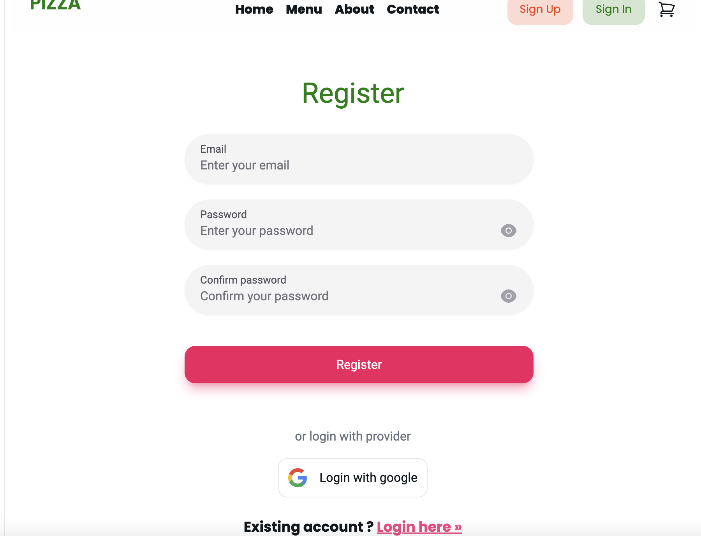
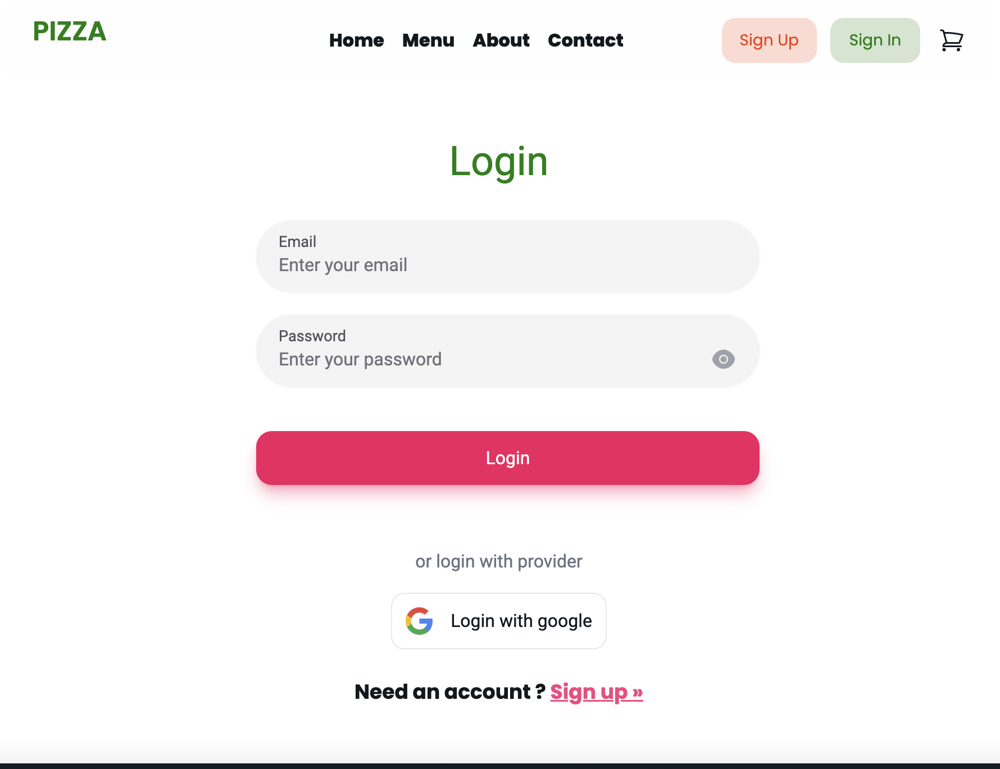

# Tran Quang Thuan
# Food Ordering App ** Next.JS **
# Required
* you have to add url for .env
1. NEXTAUTH_SECRET=

2. GOOGLE_CLIENT_ID=
3. GOOGLE_CLIENT_SECRET=

4. NEXT_PUBLIC_CLOUDINARY_CLOUD_NAME=
5. NEXT_PUBLIC_UPLOAD_PRESET=
6. NEXTAUTH_URL=

	<code></code>
  <code></code>
	<code></code>
    <code></code>
	  <code></code>
  <code></code>

## 📘 Introduction 

✨🚀 **A delivery web application that allows customers to order food online. The application also allows customers to manage their profile, view their orders history and shipping addresses.
It is built using modern web technologies and provides an intuitive and easy-to-use interface for customers to order their favorite pizzas.
Built from scratch with the robust framework Next.js 14 and MongoDB.** ✨🚀

## Tech Stack :
* ➡️ **Next JS**: used as a full-stack framework, enabling the creation of a modern full-stack application with features such as server-side rendering and a simplified development process for both the front end and back end
* ➡️ **NextAuth**:  a flexible and configurable authentication solution that supports various sign-on services, was used for credentials and Google authentication in this application. 
* ➡️ **Formik - Yup**: Formik, when paired with Yup, simplifies form validation in React by abstracting complexities and providing support for schema-based form-level validation through Yup.
* ➡️ **useSWR**: a React Hooks library for data fetching that simplifies the process of fetching and handling client-side data in Next.js,
* ➡️ **Zustand**: a small, fast, and scalable state management solution for React.
* ➡️ **Next UI - Tailwind CSS**: NextUI is a UI library for React that combines the power of Tailwind CSS with React Aria to provide complete components (logic and styles) for building accessible and customizable user interfaces. 

##  Screenshots 🎬 

